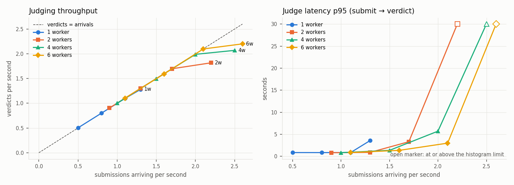
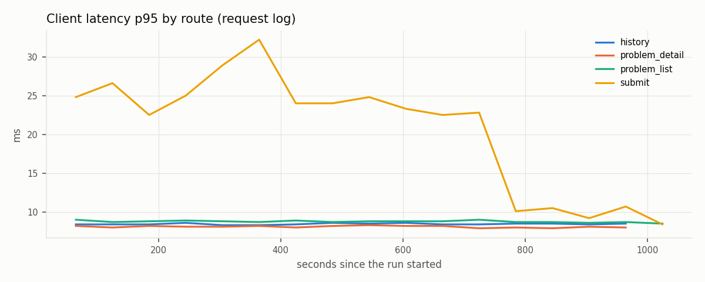
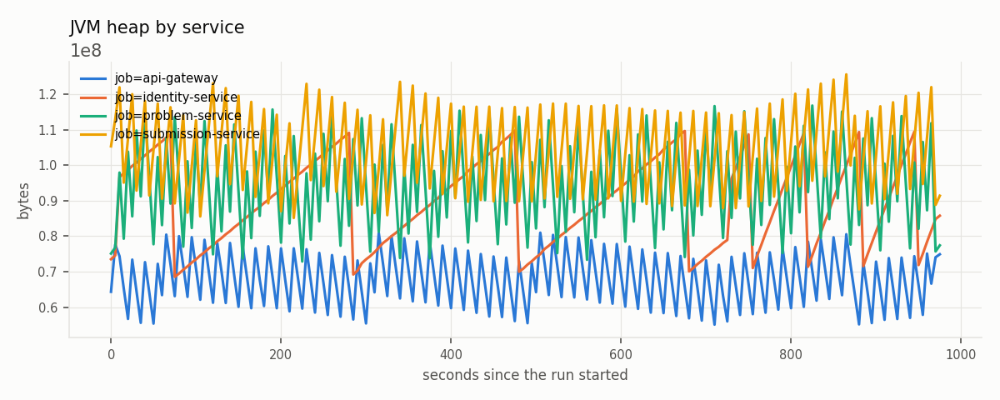
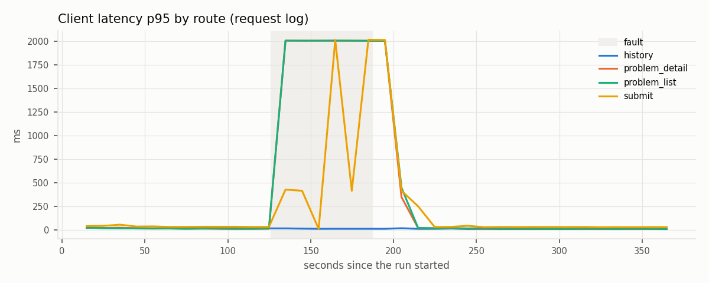
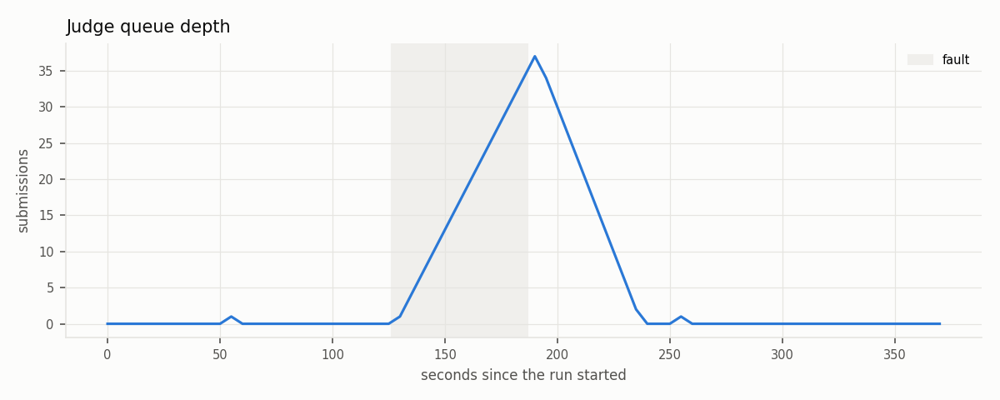
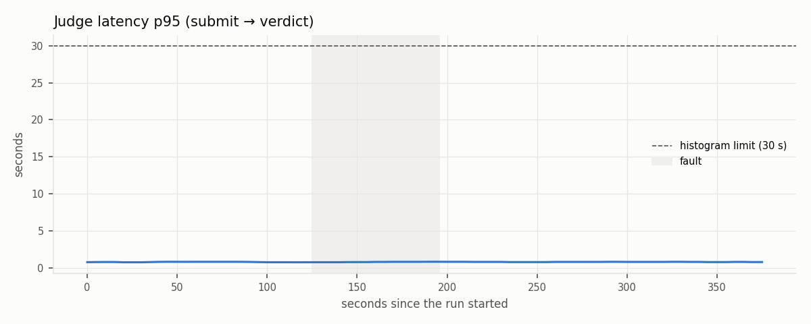
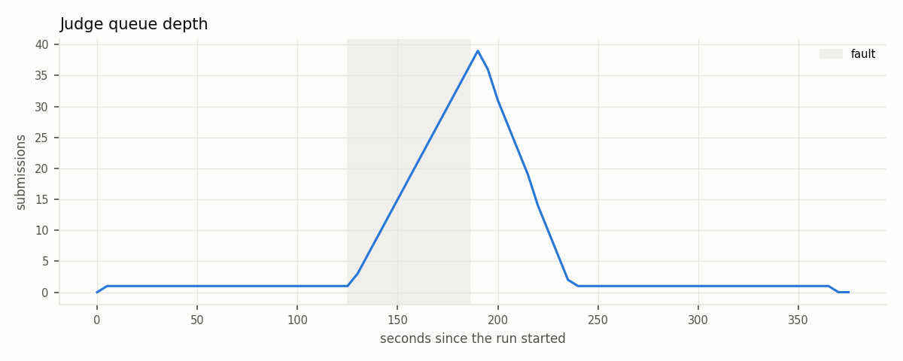
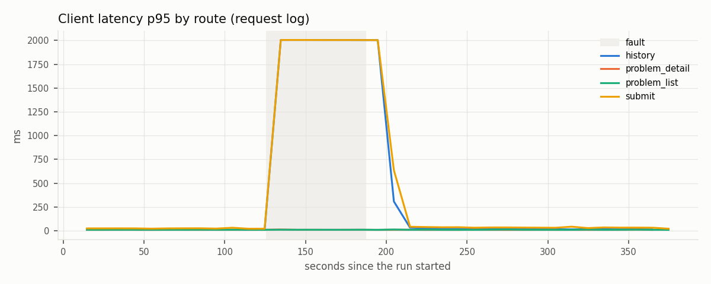
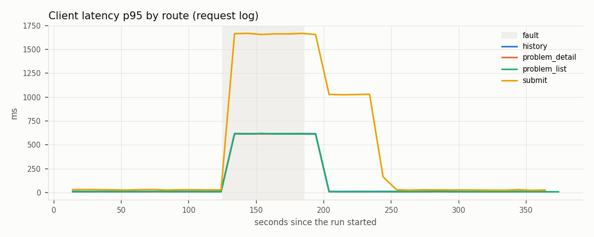

# Sub-project 5 — load and chaos evaluation: report

Every table and chart below comes from a file under `bench/results/` on this branch, and every run can be repeated
from `bench/README.md`. Raw data per run: `run.json` (arguments, commits, image ids), `summary.json` (k6),
`k6.log` (one line per request), `series/*.csv` (Prometheus), `invariant.json`; for C2 and C3 also `worker-log.txt`,
an excerpt of the judge-worker's log. A few observations come from outside the per-run files and say so where they
appear: the host's memory and swap (the campaign's session logs in `bench/results/sessions/`, or read during a
session), the seed's timing (noted during the session) and the host description.
The 16 E2 `summary.json` files were written before the fix that keeps access tokens out of them (`3a595f8`); their
`setup_data` field was removed afterwards by script, and nothing else in them changed.

## 1. Setup

- **Host.** One laptop: Intel Core i7-1165G7 (4 cores, 8 threads, 2.8 GHz base), 11 GB RAM, Linux 7.0.0-34,
  Docker 29.7.2, Compose 5.1.3. The system under test, Prometheus, k6 and the analysis all share it.
- **System under test.** `judge-deployment`'s production Compose file, run as project `oj-bench` with
  `bench/compose.bench.yml`: Prometheus scrapes every 5 s and accepts k6's remote write, `judge-portal` is left
  out, and the five built services run the same images as the live stack (`pull_policy: never`).
- **Versions** (`run.json`). The service commits below and every image id are the same in all 46 run directories (42 measured runs
  and 4 pilots).
  judge-deployment was at `40fcc84` for E2, `20f5c7d` for E1 and E3, and `7abea79` for E4; these three commits
  differ only under `bench/`, through the harness fixes made on this branch.

  | repository | commit |
  |---|---|
  | judge-deployment | `40fcc84` |
  | oj-common | `ad10a26` |
  | oj-api-gateway | `01ee0ff` |
  | oj-identity-service | `9372f23` |
  | oj-problem-service | `0f9a8b1` |
  | oj-submission-service | `4f7163a` |
  | judge-worker | `c748655` |

- **Configuration.** 2 sandboxes (`judge-server`, `judge-server-2`); 6 partitions on `submission.requested`;
  a per-user submit cooldown of 10 s, so the 200 bench users allow at most 20 submissions/s (the harness refuses
  rates above 90 % of that, 18/s); the reconcile job
  turns a submission still PENDING or JUDGING after 5 minutes into SYSTEM_ERROR.
- **Load generator.** k6 2.3.0 (pinned by digest), `--cpus 1`, on `oj-net`, every request through the gateway.
- **Data.** 200 users `bench_u001…bench_u200`; problems `bench-ab` (A + B) and `bench-sum`, 5 test cases each.
  Every seed submits the reference solutions in C++ and Python 3 and refuses to go on unless all four are
  ACCEPTED.

## 2. Method

- Open model: k6 `constant-arrival-rate` / `ramping-arrival-rate`, so a slow system does not slow the arrivals.
  A run reports the iterations k6 could not start on time (`dropped_iterations`). One run had some (E1, §3); no
  other run did.
- Each measurement runs **3 times**; tables give the median and the min–max spread. The first 60 s of a run are
  warm-up and excluded.
- Every percentile is given with its sample count `n`; a p99 is given only where `n ≥ 500`.
- **Submit → verdict latency** is the server's `oj_judge_latency_seconds` histogram. Its top bucket is 30 s, so a
  quantile that lies above it is printed "≥ 30" (an open marker in the charts) rather than an invented number.
- **Throughput** counts every applied verdict through that timer's `_count`. The per-status verdict counters are
  created lazily, so their first increment is invisible to `increase()`.
- **Accepted submission** means HTTP 200 with a submission id. The **invariant** of every run: each accepted
  submission is found afterwards in a terminal status; SYSTEM_ERROR ids and the status histogram are listed.
- **Drain.** After the load, a run waits until the judge queue is empty *and* the `judge-workers` consumer group
  has no lag on `submission.requested` — the queue gauge alone reads 0 while messages still wait in Kafka.
- **Client latency over time** comes from k6's per-request log lines (millisecond precision). k6's remote-written
  trend statistics are cumulative since the start of the run, so they cannot show a change during it.
- A run that fails is repeated on a re-created stack; a run that leaves the queue undrained or fails its
  invariant is kept, and the stack is re-created before the next one.

## 3. E1 — read latency

Reads at 20, 50 and 100 req/s, spread evenly over the problem list, one problem's detail and the user's
submission history (each user has two judged submissions), 180 s measured after a 60 s warm-up.

Runs: 9. Each cell: median (min–max) over the runs. Runs with dropped iterations: 1 of 9 (k6 could not start an arrival on time).

| req/s | route | p50 ms | p95 ms | p99 ms | n | errors % |
|---|---|---|---|---|---|---|
| 20 | problem_list | 5.7 (4.0–7.9) | 9.1 (8.3–11.6) | 10.6 (9.1–14.4) | 1201 (1200–1201) | 0.00 (0.00–0.00) |
| 20 | problem_detail | 5.4 (3.8–7.4) | 8.5 (7.6–10.8) | 11.5 (8.8–12.4) | 1200 (1200–1200) | 0.00 (0.00–0.00) |
| 20 | history | 5.8 (3.9–7.5) | 8.5 (7.8–11.2) | 9.5 (9.4–12.6) | 1200 (1200–1200) | 0.00 (0.00–0.00) |
| 50 | problem_list | 6.8 (3.8–7.4) | 8.2 (8.1–8.3) | 10.9 (9.7–11.3) | 3001 (3001–3001) | 0.00 (0.00–0.00) |
| 50 | problem_detail | 6.4 (3.7–6.8) | 7.7 (7.6–7.8) | 9.7 (8.6–10.7) | 3000 (3000–3000) | 0.00 (0.00–0.00) |
| 50 | history | 6.4 (3.9–6.9) | 7.8 (7.7–8.2) | 10.1 (8.9–11.2) | 3000 (3000–3000) | 0.00 (0.00–0.00) |
| 100 | problem_list | 3.0 (2.9–3.0) | 5.2 (4.7–7.5) | 9.8 (7.0–15.5) | 6001 (5715–6001) | 0.00 (0.00–0.00) |
| 100 | problem_detail | 2.8 (2.6–2.8) | 5.7 (4.8–7.2) | 9.5 (6.5–16.4) | 6000 (5714–6000) | 0.00 (0.00–0.00) |
| 100 | history | 2.9 (2.8–2.9) | 5.1 (4.9–7.3) | 9.5 (6.6–13.8) | 6000 (5714–6000) | 0.00 (0.00–0.00) |

- **No errors at any rate, p95 at or under 10 ms** (median of the runs). At 100 req/s the read path is far from
  saturated on this host. The figures are end to end: gateway hop, JWT check, the owning service and its
  database. Splitting them per hop needs trace sampling (follow-up 8.4).
- **Latency is lowest at the highest rate** (p50 5.4–6.8 ms at 20 and 50 req/s, 2.8–3.0 ms at 100 req/s). This is
  consistent with CPU power states on a mostly idle laptop, where cores sleep between requests at low rates. Not
  investigated.
- **One stall.** Run `20261007-102621-e1-r100` dropped 858 arrivals (n = 5,715 instead of 6,000 per route)
  around a single 9 s pause in the measured window. The host had 3.9 of its 4 GB swap in use (read during the session, not
  logged), so swapping is the likely cause; the bench stack's logs went with it, so it cannot be confirmed. The run is kept in the table.

## 4. E2 — judging capacity

`bench-sum` submissions, alternating C++ and Python 3, in four 3-minute steps per worker count after a 60 s
warm-up. The steps were fixed from one pilot per worker count (pilot steps 0.5, 1, 1.5, 2 × workers per second,
60 s each; measured steps = pilot capacity × 0.5, 0.75, 1, 1.25).

Runs: 12. Each cell: median (min–max) over the runs. Runs with dropped iterations: 0 of 12 (k6 could not start an arrival on time).

| workers | target/s | measured/s | verdicts/s | p50 s | p95 s | p99 s | n | saturated runs |
|---|---|---|---|---|---|---|---|---|
| 1 | 0.5 | 0.50 (0.50–0.50) | 0.50 (0.50–0.50) | 0.72 (0.72–0.75) | 0.85 (0.83–1.22) | — | 91 (89–91) | 0/3 |
| 1 | 0.8 | 0.80 (0.80–0.80) | 0.80 (0.80–0.80) | 0.72 (0.72–0.73) | 0.85 (0.84–0.85) | — | 144 (144–144) | 0/3 |
| 1 | 1.1 | 1.10 (1.10–1.10) | 1.10 (1.10–1.10) | 0.72 (0.72–0.75) | 0.86 (0.84–1.05) | — | 197 (197–199) | 0/3 |
| 1 | 1.3 | 1.30 (1.30–1.30) | 1.28 (1.13–1.30) | 0.82 (0.76–1.39) | 3.57 (1.39–14.53) | — | 230 (203–233) | 1/3 |
| 2 | 0.9 | 0.90 (0.90–0.90) | 0.90 (0.90–0.90) | 0.72 (0.72–0.72) | 0.82 (0.80–0.82) | — | 163 (163–163) | 0/3 |
| 2 | 1.3 | 1.30 (1.30–1.30) | 1.30 (1.30–1.30) | 0.74 (0.73–0.74) | 0.89 (0.87–0.92) | — | 235 (233–235) | 0/3 |
| 2 | 1.7 | 1.70 (1.70–1.70) | 1.70 (1.70–1.70) | 1.50 (1.36–1.62) | 3.31 (2.83–3.59) | — | 305 (305–307) | 0/3 |
| 2 | 2.2 | 2.20 (2.20–2.20) | 1.82 (1.81–1.82) | 11.64 (11.27–16.37) | ≥ 30 | ≥ 30 | 327 (326–328) | 3/3 |
| 4 | 1 | 1.00 (1.00–1.00) | 1.00 (1.00–1.00) | 0.72 (0.72–0.72) | 0.83 (0.83–0.85) | — | 180 (180–180) | 0/3 |
| 4 | 1.5 | 1.50 (1.50–1.50) | 1.50 (1.50–1.50) | 0.85 (0.81–0.86) | 1.36 (1.30–1.36) | — | 269 (269–269) | 0/3 |
| 4 | 2 | 2.00 (2.00–2.00) | 1.99 (1.97–2.00) | 1.81 (1.76–2.22) | 5.71 (3.83–6.76) | — | 358 (354–360) | 0/3 |
| 4 | 2.5 | 2.50 (2.50–2.50) | 2.07 (2.03–2.09) | 10.10 (8.23–13.04) | ≥ 30 | ≥ 30 | 372 (366–375) | 3/3 |
| 6 | 1.1 | 1.10 (1.10–1.10) | 1.10 (1.10–1.10) | 0.72 (0.72–0.75) | 0.86 (0.84–1.01) | — | 199 (197–199) | 0/3 |
| 6 | 1.6 | 1.60 (1.60–1.60) | 1.59 (1.59–1.60) | 0.85 (0.84–0.86) | 1.35 (1.24–1.38) | — | 287 (287–288) | 0/3 |
| 6 | 2.1 | 2.10 (2.10–2.10) | 2.10 (2.09–2.10) | 1.55 (1.54–1.77) | 2.99 (2.96–3.24) | — | 377 (376–379) | 0/3 |
| 6 | 2.6 | 2.60 (2.60–2.60) | 2.20 (2.20–2.22) | 11.75 (11.74–12.67) | ≥ 30 | ≥ 30 | 396 (396–399) | 3/3 |

| workers | capacity, verdicts/s (median of the runs' best step) | highest unsaturated step, /s | SYSTEM_ERROR per run |
|---|---|---|---|
| 1 | 1.28 | 1.3 | 0 (0–0) |
| 2 | 1.82 | 1.7 | 0 (0–0) |
| 4 | 2.07 | 2 | 0 (0–0) |
| 6 | 2.20 | 2.1 | 0 (0–0) |

**Well below capacity the latency is the cost of one judgement, not of queueing.** At every worker count the
lowest step shows p50 0.72 s and p95 0.82–0.86 s: the time to compile and run five tests. Near capacity queueing
already shows while the system still keeps up: at the third step, p95 is 3.0–5.7 s with 2, 4 and 6 workers (0.86 s
with 1 worker). Once arrivals pass capacity, the queue grows for the whole step (open model): p50 jumps to 10–12 s
(median of the runs) and p95 passes the histogram's 30 s ceiling within three minutes.

**Scaling stops after two workers.** Scaling efficiency, capacity(N) / (N × capacity(1)):

| workers | capacity, verdicts/s | efficiency |
|---|---|---|
| 1 | 1.28 | 1.00 |
| 2 | 1.82 | 0.71 |
| 4 | 2.07 | 0.40 |
| 6 | 2.20 | 0.29 |

Going from 4 to 6 workers adds about 6 %. The workers are not the bottleneck past two: every verdict needs one of
the two sandboxes and CPU on a 4-core host that also runs the services, the databases, Kafka and k6. The
campaign did not sample per-container CPU, so it cannot say which of the two limits the plateau (follow-up 8.1).

**The 1-worker capacity is only known to lie between 1.1 and 1.3 verdicts/s.** At 1.3/s two runs kept up and one
delivered 1.13/s; the pilot, overloaded harder (1.5 and 2/s for 60 s), delivered 1.04–1.07/s. Heavier overload
costs throughput: the saturated pilot steps of every worker count delivered 4–19 % less than the measured
capacity. The efficiencies are therefore approximate. With capacity(1) = 1.13 they would be 0.81, 0.46 and 0.33
instead of 0.71, 0.40 and 0.29; the plateau shows either way.

**The language mix probably matters.** A side observation, not a measurement: when the E1 seed submitted 400
`bench-ab` Python 3 solutions, one worker judged them in about 85 s (≈ 4.7/s; noted during the session, not recorded in a file), against 1.28/s for
E2's half-C++ `bench-sum` mix. The problem differs as well as the language, so this does not isolate the C++
compile; a C++-only and a Python-only E2 step would.

## 5. E3 — sustained mixed load

15 minutes at 0.6 submissions/s — half the 1-worker capacity, rounded — plus 20 reads/s, one worker.

Runs: 3. Each cell: median (min–max) over the runs. Runs with dropped iterations: 0 of 3 (k6 could not start an arrival on time).

| route | p50 ms | p95 ms | p99 ms | n | errors % |
|---|---|---|---|---|---|
| problem_list | 5.7 (5.4–5.8) | 8.8 (8.7–10.2) | 11.3 (10.6–11.8) | 6001 (6001–6001) | 0.00 (0.00–0.00) |
| problem_detail | 5.4 (5.3–5.9) | 8.2 (8.1–9.5) | 10.4 (9.5–11.5) | 6000 (6000–6000) | 0.00 (0.00–0.00) |
| history | 5.9 (5.4–5.9) | 8.7 (8.5–10.2) | 11.5 (10.6–12.3) | 6000 (6000–6000) | 0.00 (0.00–0.00) |
| submit | 14.5 (14.1–20.8) | 23.5 (22.0–32.2) | 27.9 (25.1–35.7) | 541 (541–541) | 0.00 (0.00–0.00) |

| measure | value |
|---|---|
| judge latency p95, s (n) | 0.83 (0.80–0.87) (540 (540–541)) |
| SYSTEM_ERROR submissions | 0 (0–0) |
| verdict consumer lag, max | 0 (0–0) |
| outbox oldest age, max, s | 0.0 (0.0–0.0) |
| heap max, job=api-gateway, MB | 77 (77–78) |
| heap max, job=identity-service, MB | 105 (104–106) |
| heap max, job=problem-service, MB | 111 (109–112) |
| heap max, job=submission-service, MB | 120 (117–121) |

- **Steady state holds.** Judge p95 stays at 0.83 s (the same as E2 below saturation), the verdict consumer
  never lags, the outbox never holds a message for a measurable time, and every run passes the invariant
  (578 accepted, 0 SYSTEM_ERROR). Heap is a flat sawtooth: no growth over 15 minutes.
- **Submit latency steps down at minute 12.** In all three runs the submit p50 falls from ≈ 19 ms to ≈ 8 ms
  at minute 12 and stays there; the reads do not change. Minute 12 is when the harness replaces every user's
  access token (`RELOGIN_AFTER_MS`). The submit path has no token-keyed cache, so the mechanism is not
  identified (follow-up 8.5). The table's submit percentiles mix both regimes.

## 6. E4 — resilience

Each fault of spec §3.5 on E3's submit rate (0.6 submissions/s) with 10 reads/s and one worker: 120 s steady, the fault held
60 s, then 180 s after the component is started again. `bench/chaos/fault.sh` stops the container (`docker stop`,
SIGTERM with a grace period; for c2 `docker stop --time 0`, a kill) and later starts the same container again.
Times come from k6's per-request log, each request stamped when its response arrived.

| fault | stopped |
|---|---|
| c1 | problem-service |
| c2 | the judge-worker, killed |
| c3 | `judge-server-2`, one of the two sandboxes |
| c4 | Kafka |
| c5 | submission-service |
| c6 | Redis |

Runs: 18. Each cell: median (min–max) over the runs. Runs with dropped iterations: 0 of 18 (k6 could not start an arrival on time).

| fault | route | errors during % | first error after inject, s | first success after removal, s | queue back, s | breaker open after, s | alerts firing, s after inject | invariant | SYSTEM_ERROR |
|---|---|---|---|---|---|---|---|---|---|
| c1 | history | 0.0 (0.0–0.0) | — | 0.2 (0.1–0.2) | 3 (3–3) | 9 (9–14) | ProblemServiceCircuitOpen 74 (69–74); ProblemServiceDown 69 (69–74) | 3/3 | 0.0 (0.0–0.0) |
|  | problem_detail | 99.0 (99.0–99.5) | 0.6 (0.6–0.7) | 13.1 (13.1–13.9) |  | | | |  |
|  | problem_list | 99.0 (99.0–99.5) | 0.8 (0.6–0.8) | 13.1 (13.1–13.9) |  | | | |  |
|  | submit | 100.0 (100.0–100.0) | 0.8 (0.8–1.2) | 22.8 (21.6–24.5) |  | | | |  |
| c2 | history | 0.0 (0.0–0.0) | — | 0.1 (0.1–0.2) | 53 (49–54) | — | none | 3/3 | 0.0 (0.0–0.0) |
|  | problem_detail | 0.0 (0.0–0.0) | — | 0.0 (0.0–0.1) |  | | | |  |
|  | problem_list | 0.0 (0.0–0.0) | — | 0.2 (0.2–0.3) |  | | | |  |
|  | submit | 0.0 (0.0–0.0) | — | 0.1 (0.1–1.2) |  | | | |  |
| c3 | history | 0.0 (0.0–0.0) | — | 0.3 (0.0–0.3) | 4 (4–5) | — | none | 3/3 | 0.0 (0.0–0.0) |
|  | problem_detail | 0.0 (0.0–0.0) | — | 0.2 (0.2–0.2) |  | | | |  |
|  | problem_list | 0.0 (0.0–0.0) | — | 0.1 (0.1–0.1) |  | | | |  |
|  | submit | 0.0 (0.0–0.0) | — | 0.1 (0.0–0.3) |  | | | |  |
| c4 | history | 0.0 (0.0–0.0) | — | 0.1 (0.0–0.3) | 54 (54–54) | — | none | 3/3 | 0.0 (0.0–0.0) |
|  | problem_detail | 0.0 (0.0–0.0) | — | 0.2 (0.0–0.2) |  | | | |  |
|  | problem_list | 0.0 (0.0–0.0) | — | 0.1 (0.1–0.2) |  | | | |  |
|  | submit | 0.0 (0.0–0.0) | — | 1.0 (1.0–1.2) |  | | | |  |
| c5 | history | 99.0 (99.0–99.0) | 0.7 (0.6–0.8) | 15.9 (15.2–16.8) | 23 (18–23) | — | SubmissionServiceDown 64 (64–69) | 3/3 | 0.0 (0.0–0.0) |
|  | problem_detail | 0.0 (0.0–0.0) | — | 0.1 (0.0–0.2) |  | | | |  |
|  | problem_list | 0.0 (0.0–0.0) | — | 0.1 (0.0–0.2) |  | | | |  |
|  | submit | 97.3 (97.3–97.3) | 4.0 (3.9–4.1) | 16.4 (16.2–17.8) |  | | | |  |
| c6 | history | 0.0 (0.0–0.0) | — | 0.1 (0.1–0.2) | 4 (4–5) | — | none | 3/3 | 0.0 (0.0–0.0) |
|  | problem_detail | 0.0 (0.0–0.0) | — | 0.1 (0.0–0.3) |  | | | |  |
|  | problem_list | 0.0 (0.0–0.0) | — | 0.2 (0.2–0.3) |  | | | |  |
|  | submit | 0.0 (0.0–0.0) | — | 0.1 (0.0–1.7) |  | | | |  |

"Queue back" is the time after the restart until the judge queue is at its pre-fault level again.

Client latency in the minute before the fault and during it, in ms, as the median (min–max) over the three runs. These come
from the responses in `k6.log` whose arrival falls in each window; `problem_detail` behaves like `problem_list`
and is left out.

| fault | route | p50 before | p50 during | p95 during |
|---|---|---|---|---|
| c1 | problem_list | 8 (6–8) | 2004 (2004–2005) | 2005 (2005–2007) |
| c1 | history | 8 (8–10) | 10 (9–11) | 11 (11–14) |
| c1 | submit | 22 (22–28) | 9 (9–11) | 2012 (2010–2015) |
| c2 | problem_list | 8 (6–9) | 10 (10–10) | 11 (11–12) |
| c2 | history | 6 (6–7) | 9 (9–10) | 11 (11–11) |
| c2 | submit | 26 (26–30) | 28 (22–30) | 30 (30–32) |
| c3 | problem_list | 8 (8–8) | 7 (7–8) | 10 (10–10) |
| c3 | history | 7 (6–8) | 7 (6–7) | 10 (10–10) |
| c3 | submit | 23 (23–26) | 24 (23–24) | 27 (26–28) |
| c4 | problem_list | 6 (6–8) | 8 (8–8) | 10 (10–10) |
| c4 | history | 7 (6–7) | 8 (8–9) | 10 (10–10) |
| c4 | submit | 22 (20–22) | 24 (23–27) | 36 (34–37) |
| c5 | problem_list | 7 (4–8) | 8 (7–9) | 10 (9–10) |
| c5 | history | 6 (4–7) | 2003 (2003–2004) | 2005 (2005–2005) |
| c5 | submit | 20 (13–20) | 2004 (2003–2004) | 2005 (2005–2010) |
| c6 | problem_list | 6 (6–7) | 613 (601–639) | 615 (603–641) |
| c6 | history | 8 (7–9) | 615 (603–642) | 618 (606–644) |
| c6 | submit | 24 (24–25) | 1624 (1616–1629) | 1661 (1658–1668) |

**The invariant held under every fault.** In all 18 runs every accepted submission reached a terminal verdict,
none of them SYSTEM_ERROR, and k6 dropped no arrivals. The answers to spec §3.5's questions, fault by fault:

- **C1 — problem-service stopped.** Problem reads fail for the whole outage, each one after 2 s: the gateway
  waits out its upstream connect timeout (`connect-timeout: 2000`) for a container that is gone. Submit needs the
  problem's judge spec over gRPC, so it fails too, but fails fast once the breaker is open (p50 9 ms). The breaker
  opened 9–14 s after the stop. Until then, and on every half-open probe, a submit waits out the 2 s gRPC deadline,
  which is the p95. Verdicts are still applied: history (submission-service only) has no errors, and every
  submission accepted before the stop was judged. Reads recover 13 s after the restart, the time problem-service
  takes to start. Submit recovers about 10 s after the reads, which is the breaker's 10 s wait in the open state
  before it tries again. Both alerts fire at 69–74 s (each has `for: 1m`).

  

- **C2 — judge-worker killed.** Nothing fails for a user, but judging stops. In run `20261007-121936-e4-c2` the
  kill landed 92 ms after the worker had started judging submission `2f492edd…`. The worker commits a message's
  offset only after publishing its verdict, so after the restart the same message was delivered again and judged.
  The run's `worker-log.txt` shows both starts, and the submission ended ACCEPTED, not SYSTEM_ERROR. In the other
  two runs the kill fell between two submissions: their excerpts show no submission judged twice. The queue is back 49–54 s after the restart, and the backlog explains this:
  60 s of arrivals at 0.6/s is 36 submissions, which one worker drains at a net 1.28 − 0.6 = 0.68/s, about 53 s.

  

- **C3 — one sandbox stopped.** No errors, and the judge p95 does not move: its highest value is 0.80–0.87 s during the
  fault, against 0.84–0.86 s in the minute before. The worker starts each judgement on the next sandbox in turn and falls through to the
  other when that one fails. The stopped sandbox's name no longer resolves, so each failure is immediate, even
  though every other submission still tries the stopped sandbox first (`worker-log.txt`: one failure every ≈ 3.3 s).
  The throughput loss cannot be measured in this setup: one worker judges one submission at a time, so at this
  load the second sandbox adds no capacity.

  

- **C4 — Kafka stopped.** Nothing fails for a user. A submit commits its row and its outbox record in one
  transaction, and the outbox holds the record until Kafka is back: the oldest record's age peaks at 58–62 s,
  the whole outage. Judging stops, and the queue drains as in C2 (54 s). The submit p95 is 34–37 ms during the
  fault.

  

- **C5 — submission-service stopped.** History and submit fail, each after the gateway's 2 s connect timeout;
  problem reads are untouched. In each run one submit was still accepted within half a second of the stop,
  while the service was shutting down gracefully, and it was judged. Verdicts produced while the service was
  down waited in Kafka and were applied after the restart, so no verdict was lost. Recovery takes 16 s, the
  service's start-up. `SubmissionServiceDown` fired at 64–69 s.

  

- **C6 — Redis stopped.** Nothing fails, because every Redis lookup fails open by design: the submit cooldown
  (`SubmissionRateLimiter`), the gateway's ban lookup (`AccessBanFilter`) and its token-revocation lookup
  (`RevokedTokenFilter`). The cost is latency. Every request waits out the gateway's 250 ms Redis timeout on
  both lookups and takes about 615 ms in all; the ≈ 115 ms beyond the two timeouts is not explained. A submit
  also waits out submission-service's 1 s timeout, about 1.6 s in all. Once Redis is back, the gateway recovers within 4 s, but submits stay at about 1 s for another 13–48 s.
  That fits the reconnect back-off of submission-service's Redis client, but was not confirmed. Live verdict
  push (SSE) also goes through Redis pub/sub, but the bench has no SSE client, so it was not measured. No alert
  fired.

  

## 7. E5 — the `KafkaConsumerLagging` threshold

**T = 10.** `KafkaConsumerLagging` now reads `max by (job, client_id)
(kafka_consumer_fetch_manager_records_lag_max{job=~"submission-service|problem-service"}) > 10` for 5 minutes,
instead of `> 0`.

Spec §3.6 set the threshold at the number of messages one worker judges in about 2 minutes (≈ 1.28 × 120 ≈ 154).
The plan replaced that rule (its correction P7): `KafkaConsumerLagging` watches the verdict consumer and
problem-service's statistics consumer, not the judge queue (the Python worker's lag is not exported), so a judging
rate says nothing about the lag it alerts on. The plan's rule instead: twice the highest verdict-consumer lag
(`records_lag_max` of submission-service) seen while the system kept up, that is in E2's unsaturated steps and in
E3, with a floor of 10. All 41 of those values (38 steps, 3 runs) are 0, so the floor applies. The lag was 0 in the
saturated steps too, and in every E4 run. Even C5, which stopped the verdict consumer for a minute, left only the
verdicts of the one or two submissions still queued at the stop waiting for it, since submits failed meanwhile.
At these rates the verdict consumer is never the bottleneck: the backlog builds in front of the judge-worker,
where the queue alerts look. The statistics consumer was not measured (the analysis reads submission-service's
lag only), so the threshold applies to it untested. The measurements can confirm that any sustained lag is
abnormal, but they cannot calibrate the threshold beyond its floor. `alerts_test.yml` pins the boundary: a lag of 10 held for
10 minutes stays silent, and a lag of 11 fires.

## 8. Findings and follow-ups

Recorded, not fixed (spec §1).

1. **Capacity plateau at ≈ 2.1–2.2 verdicts/s** (E2, 4 and 6 workers). Next step: sample per-container CPU
   (cAdvisor or `docker stats`) during an E2 step, then add a third sandbox or move the sandboxes to another host,
   whichever the samples point at.
2. **Overload turns submissions into SYSTEM_ERROR.** The reconcile job fails any submission still waiting after
   5 minutes, and the late verdict is then discarded. The pilots, which overloaded the stack for longer than that,
   lost 326 of 1,410 accepted submissions (4 workers, `20261005-221803-e2-w4-pilot`) and 935 of 2,115
   (6 workers, `20261005-223214-e2-w6-pilot`). Under a sustained backlog the system fails work it would have
   finished. Options: scale the timeout with the queue depth, or reconcile only submissions whose message is no
   longer in Kafka.
3. **The judge-latency histogram ends at 30 s**, so every saturated percentile is censored. Add buckets up to
   5 minutes (the reconcile timeout).
4. **No per-hop breakdown of read latency** (E1). Sample traces in Jaeger during an E1 run to split the
   gateway, the JWT check, the service and its database.
5. **Submit latency halves when the access tokens are replaced** (E3, all three runs, minute 12). Compare
   traces of a submit with a 12-minute-old token and with a fresh one.
6. **A stopped upstream costs every request 2 s** (C1, C5). The gateway waits out its 2 s connect timeout on
   each request to a service that is down, and submission-service waits out its 2 s gRPC deadline until its
   breaker opens, and again on every half-open probe. A user sees a 2 s hang, then a 503. A circuit breaker per
   route in the gateway would answer at once.
7. **A Redis outage silently switches enforcement off and slows every request** (C6). The submit cooldown, the IP
   and device bans and logout (token revocation) all fail open. That is a deliberate choice for availability, but
   the code means that for the length of an outage a logged-out token works again and a banned client gets in,
   with no alert to say so (read from the code; the bench sent no logged-out tokens and no banned clients). Every
   request pays 0.6–1.6 s of timeouts. Options: an alert on Redis (item 9); a breaker
   around the lookups, so that an outage costs one timeout instead of one per request; and a per-lookup decision
   on failing open (cooldown, bans) or closed (revocation).
8. **Submit stays slow for up to 48 s after Redis is back** (C6), while the gateway recovers in 4 s. Check the
   reconnect settings of submission-service's Redis client (Lettuce).
9. **Four of the six faults raise no alert** (C2, C3, C4, C6). No rule covers a judge-worker, a sandbox, Kafka or
   Redis being down, and over a 60 s outage the indirect rules cannot fire either: `OutboxBacklogStale` needs an
   age above 60 s for 2 minutes, and `JudgeQueueStalled` needs 15 minutes. Add availability rules for Kafka and
   Redis (through exporters), and for the worker and the sandboxes, for example on the sandbox heartbeats the
   worker already sends to submission-service.
10. **The worker keeps trying a dead sandbox** (C3): every other judgement starts on it. That cost nothing here
    because the failure is immediate, but a sandbox that hangs instead of disappearing would cost each of those
    judgements its request timeout. Skip a sandbox for a while after it fails.
11. **The `KafkaConsumerLagging` threshold cannot be calibrated by load** (E5): no run, overloaded or faulted,
    showed any verdict-consumer lag. The threshold is the floor, 10; revisit it if production shows lag.

## 9. Threats to validity

- **One shared host.** The system, its dependencies, k6 and Prometheus compete for the same 4 cores; absolute
  numbers are this laptop's, the shapes (plateau, knee) are what carries over. k6 is limited to one CPU.
  The 1-minute load average before a run ranged from 0.5 to 9.9 (`run.json` `loadavg_before`), because a run
  starts as soon as the previous one has drained.
- **Three runs per point.** The spread is shown, but three samples cannot give a confidence interval.
- **Percentile noise at low rates.** `n` is printed with every percentile; p99 only from `n ≥ 500`.
- **k6's remote write is experimental.** Tables take k6's numbers from `summary.json`, not from the remote-written
  series.
- **Thermal and frequency behaviour** of a laptop CPU was not controlled.
- **Memory pressure.** The host's 4 GB swap was nearly full through sessions 2 and 3 (3.8–3.9 GB in use while they ran,
  all 4.0 GB at the end of E4: `bench/results/sessions/session-3.log`), with a browser and other programs also running. The E1 stall is the visible effect;
  smaller ones may be hidden in the spread.
- **E4's scope.** One worker and one load level; each fault is a clean stop held for 60 s. Throughput lost to a
  dead sandbox, a consumer-group rebalance across several workers, network partitions, slow (rather than absent)
  dependencies and full disks were not tested. The fault-window latencies in §6 come from `k6.log` by a one-off
  computation, not from `summarize`, so the analysis package does not regenerate them.
